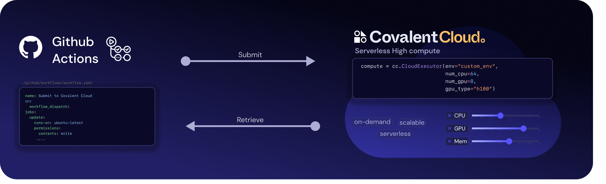
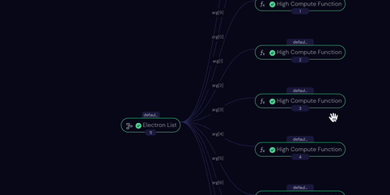

  

# Covalent Cloud GitHub Workflow Template 🚀

This repository provides a template for integrating high-performance functions on Covalent Cloud seamlessly into your GitHub Workflows. The workflow demonstrates how to dispatch compute-intensive tasks, track their status, and store results for further analysis. 

If you wish to read more, please take a look at the companion blog post, which will provide a detailed walkthrough, example use cases, and further explanations ✨. To learn more about Covalent Cloud, visit [covalent.xyz](https://www.covalent.xyz) and the documentation at [docs.covalent.xyz](docs.covalent.xyz/cloud). To use this, you need a Covalent Cloud account, please sign up [here](https://www.covalent.xyz/register).

> Note: This is just a template to get you started. You can customize it to fit your specific needs.

## Overview

  

1. Job Submission: The workflow dispatches a series of high-performance functions to Covalent Cloud. For demonstration, these functions simulate intensive computation with a sleep operation and randomly return "done" or "failed" as the outcome.
2. Status Tracking: The run status for each dispatched job is maintained in the `runid_status.csv` file.
3. Result Storage: Upon completion, results are collected and stored in the `results.csv` file.

## Getting Started

1. **Clone the Repository:** Get your own copy of this repository.
2. **Install Dependencies:** Install required packages (`pip install -r .github/workflows/requirements.txt`)
3. **Covalent Cloud API Key:** Set your Covalent Cloud API key as a GitHub secret named `CC_API_KEY`.

## Potential Enhancements

- Customization 🛠️ : Adapt to your workflow - modify `covalent_workflow.py` to replace the placeholder functions with your own computationally intensive code.
- Flexible Triggers:  Explore different trigger mechanisms (pull requests, code changes, external webhooks) to automate your workflow.
- Workflow Separation: Consider separate workflows for job submission and result monitoring, potentially with different schedules, for better modularity.
- Database Integration:  Replace the simple CSV-based status tracking with a database solution (e.g., SQLite, PostgreSQL) for scalability and advanced querying.
- Result Retrieval: Use Covalent primitives (cc.get_result) in other scripts or workflows to retrieve results and status updates for tasks dispatched within this workflow.

## Key Takeaway

This template provides a solid foundation for streamlining the integration of high-performance computing tasks into your GitHub development processes. The focus is on flexibility – adapt it to fit your specific computational needs! 💪

## Learn More 📚

Covalent Cloud Documentation: [docs.covalent.xyz/cloud](docs.covalent.xyz/cloud)

Covalent Cloud Sign Up: [covalent.xyz/register](https://www.covalent.xyz/register)

Covalent Cloud Website: [covalent.xyz](https://www.covalent.xyz)